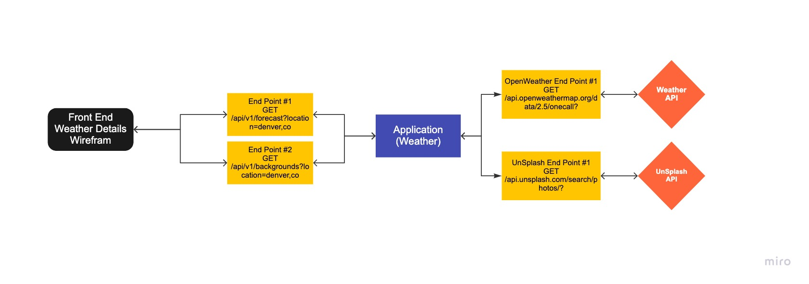

# Sweater Weather
Sweater weather is an api application that exposes 5 endpoints for front end plug in. It has weather data by city, photo search by city and key word, user registration and login, and roadtrip creation.

There are 3 APIs consumed to build the engine endpoints. See details on the APIs below.

### Created by:
- [Alexa Morales Smyth](https://github.com/amsmyth1) | [LinkedIn](https://www.linkedin.com/in/moralesalexa/)


## Contents
- [Getting Started](#getting-started)
- [Prerequisites](#prerequisites)
- [Installing](#installing)
- [Application Design](#application-design)
  - Design drawing
  - APIs consumed
  - Database Schema
- [Endpoints](#endpoints)
- [Application Features](#application-features)
- [Testing](#testing)
- [How to Contribute](#how-to-contribute)
- [Roadmap](#roadmap)
- [Contributors](#contributors)
- [Acknowledgments](#acknowledgments)

### Prerequisites
#### Built With
* [Ruby on Rails](https://rubyonrails.org)
* [HTML](https://html.com)

This project was tested with:
* RSpec version 3.10

* __Ruby__
  - The project is built with rubyonrails using __ruby version 2.5.3p105__, you must install ruby on your local machine first. Please visit the [ruby](https://www.ruby-lang.org/en/documentation/installation/) home page to get set up. _Please ensure you install the version of ruby noted above._

* __Rails__
  ```sh
  gem install rails --version 5.2.5
  ```
* __Postgres database__
  - Visit the [postgresapp](https://postgresapp.com/downloads.html) homepage and follow their instructions to download the latest version of Postgres app.

  #### Installing

  1. Clone the repo
    ```
    $ git clone git@github.com:<YOUR_GITHUB_USER_NAME>/sweater_weather.git
    ```

  2. Bundle Install
    ```
    $ bundle install
    ```

  3. Create, migrate and seed rails database
    ```
    $ rails db:{create,migrate,seed}
    ```

  4. Set up Environment Variables
     - run `bundle exec figaro install`
     - add the below variables to the `config/application.yml`
   ```
   open_weather_api_key = '<YOU_KEY_HERE>'
   open_weather_units = 'imperial' or 'metric'
   unsplash_client_id = '<YOU_KEY_HERE>'
   unsplash_accept_version = 'v1'
   unsplash_secret_key = '<YOU_KEY_HERE>'
   mapquest_api_key = '<YOU_KEY_HERE>'
   mapquest_unit = 'm' or 'k'

   ```
### Project Design
<p style="text-align:center;"></p>

#### APIs Consumed
- For location coordinates and roadtrip data: [MapQuest](https://developer.mapquest.com/)
- For location weather data: [OpenWeather](https://openweathermap.org/api)
- For location photo: [Unsplash](https://unsplash.com/developers)

#### Postman
View API endpoints consumed on [Postman](https://www.getpostman.com/collections/d339161ea943b1f5e890)

### Endpoints

| HTTP verbs | Paths  | Used for | Output |
| ---------- | ------ | -------- | ------:|
| GET | /api/v1/forecast?location=denver,co | Get the weather for a location | [json](#weather-by-location) |
| GET | /api/v1/backgrounds?location=denver,co | Get a photo for a specific location | [json](#photo-by-location) |
| POST | /api/v1/users | create a user account | [json](#create-user) |
| POST | /api/v1/sessions | create a user session (login a user) | [json](#user-login) |
| POST | /api/v1/road_trip | create a new road trip | [json](#new-road-trip) |
