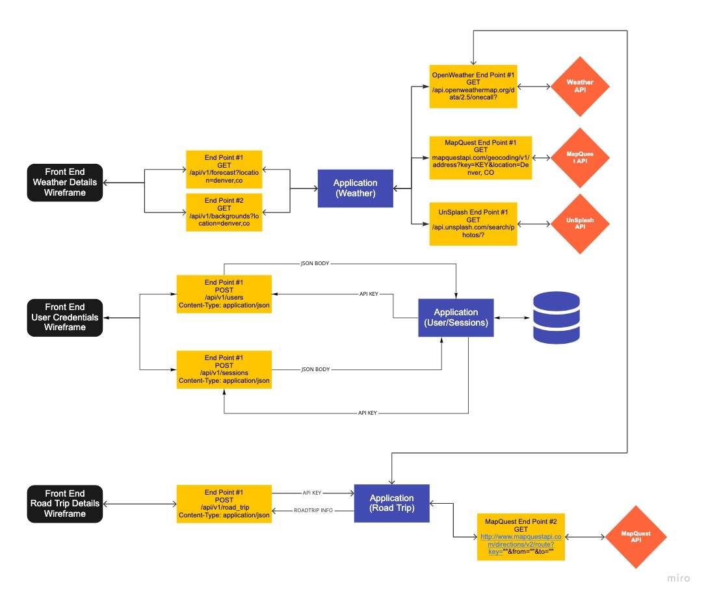

# Sweater Weather
Sweater weather is an api application that exposes 5 endpoints for front end plug in. It has weather data by city, photo search by city and key word, user registration and login, and roadtrip creation.

There are 3 APIs consumed to build the engine endpoints. See details on the APIs below.

### Created by:
- [Alexa Morales Smyth](https://github.com/amsmyth1) | [LinkedIn](https://www.linkedin.com/in/moralesalexa/)


## Contents
- [Getting Started](#getting-started)
- [Prerequisites](#prerequisites)
- [Installing](#installing)
- [Application Design](#application-design)
  - Design drawing
  - APIs consumed
  - Database Schema
- [Endpoints](#endpoints)
- [Application Features](#application-features)
- [Testing](#testing)
- [How to Contribute](#how-to-contribute)
- [Roadmap](#roadmap)
- [Contributors](#contributors)
- [Acknowledgments](#acknowledgments)

### Prerequisites
#### Built With
* [Ruby on Rails](https://rubyonrails.org)
* [HTML](https://html.com)

This project was tested with:
* RSpec version 3.10

* __Ruby__
  - The project is built with rubyonrails using __ruby version 2.5.3p105__, you must install ruby on your local machine first. Please visit the [ruby](https://www.ruby-lang.org/en/documentation/installation/) home page to get set up. _Please ensure you install the version of ruby noted above._

* __Rails__
  ```sh
  gem install rails --version 5.2.5
  ```
* __Postgres database__
  - Visit the [postgresapp](https://postgresapp.com/downloads.html) homepage and follow their instructions to download the latest version of Postgres app.

  #### Installing

  1. Clone the repo
    ```
    $ git clone git@github.com:<YOUR_GITHUB_USER_NAME>/sweater_weather.git
    ```

  2. Bundle Install
    ```
    $ bundle install
    ```

  3. Create, migrate and seed rails database
    ```
    $ rails db:{create,migrate,seed}
    ```

  4. Set up Environment Variables
     - run `bundle exec figaro install`
     - add the below variables to the `config/application.yml`
   ```
   mapquest_api_key: '<YOU_KEY_HERE>'
   weather_api_key: '<YOU_KEY_HERE>'
   photo_api_key: '<YOU_KEY_HERE>'

   ```
### Project Design
Below is an example of how the API application is designed to consume multiple APIs so the front end can easily hook into the exposed endpoints (noted in black).
<p style="text-align:center;"></p>

#### APIs Consumed
- For location coordinates and roadtrip data: [MapQuest](https://developer.mapquest.com/)
- For location weather data: [OpenWeather](https://openweathermap.org/api)
- For location photo: [Unsplash](https://unsplash.com/developers)

#### Postman
View API endpoints consumed on [Postman](https://www.getpostman.com/collections/d339161ea943b1f5e890)
View API endpoints exposted on [Postman](https://www.getpostman.com/collections/b4303ee7199f8b818552)

### Endpoints

| HTTP verbs | Paths  | Used for | Output |
| ---------- | ------ | -------- | ------:|
| GET | /api/v1/forecast?location=denver,co | Get the weather for a location | [json](#weather-by-location) |
| GET | /api/v1/backgrounds?location=denver,co | Get a photo for a specific location | [json](#photo-by-location) |
| POST | /api/v1/users | create a user account | [json](#create-user) |
| POST | /api/v1/sessions | create a user session (login a user) | [json](#user-login) |
| POST | /api/v1/road_trip | create a new road trip | [json](#new-road-trip) |

### Application Design

The application uses the Facade Design pattern. The controllers talk to the respective facades to get the necessary information packaged to the serializer.

```ruby
#Controller
class Api::V1::SalariesController < ApplicationController

  def city_info
    if SalariesFacade.location_check?(params[:destination])
      render json: SalariesSerializer.new(SalariesFacade.final_city_info(params[:destination]))
    else
      render json: NullSerializer.new, status: 204
    end
  end
end

```
```ruby
#Facade
def self.location_check?(location)
  if SalaryService.search_ua_id(location) == nil
    false
  else
    true
  end
end

def self.final_city_info(location)
  city_info = {}
  city_info[:destination] = location
  city_info[:forecast] = city_forecast(location)
  city_info[:salaries] = SalaryService.city_salary_info(location)
  city_info
  final_city_info = OpenStruct.new(city_info)
end

def self.city_forecast(location)
  coords = MapQuestService.coordinates(SalaryService.full_name(location))
  weather = WeatherService.get_city_info(coords)
  forecast = {}
  forecast[:summary] = weather[:current_weather][:conditions]
  forecast[:temperature] = weather[:current_weather][:temperature]
  forecast
end
end

```
```ruby
#Service
def self.city_all_salary_info(location)
  response = Faraday.get("https://api.teleport.org/api/urban_areas/teleport:#{search_ua_id(location)}/salaries/")
  if response.body == "Sorry, but the page you were trying to view does not exist."
    nil
  else
    raw_data = JSON.parse(response.body, symbolize_names: true)
    salaries = []
    raw_data[:salaries].map do |salary|
      salaries << salary_info(salary)
    end
    salaries
  end
end
...


```
